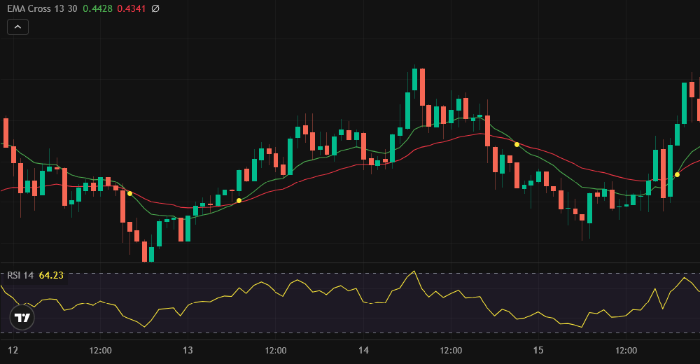

# 🧠 Quant Strategies

📈 A modular collection of algorithmic trading strategies built in Python. Designed for crypto markets and adaptable to other asset classes, this repository provides clean, testable implementations of technical strategies using `pandas`, `NumPy`, and `pandas-ta`.

---

## 🚀 Included Strategies

### 🔁 EMA + RSI Strategy

This strategy combines two key technical indicators:

- **EMA13 vs EMA30**: Measures short-term vs long-term trend direction
- **RSI (Relative Strength Index)**: Gauges momentum and potential overbought/oversold conditions

#### 📊 Signal Logic

| Signal Type | Condition | Interpretation |
|-------------|-----------|----------------|
| 🟢 **Buy (LONG)** | `EMA13 > EMA30` and `RSI > 50` | Uptrend confirmed and momentum strong |
| 🔴 **Sell (SHORT)** | `EMA13 < EMA30` and `RSI < 50` | Downtrend confirmed and momentum weak |

The strategy generates a position signal (`LONG` or `SHORT`) only when **both conditions align**, reducing noise and false entries.

---

## 📷 Strategy Preview

Here’s how the EMA + RSI strategy looks in action:



---

## 🧩 Features

- 🧱 Modular architecture for easy strategy expansion
- 🔌 Seamless integration with [CCXT](https://github.com/ccxt/ccxt) for real-time crypto data
- 🧼 Clean and readable codebase for rapid development
- 🖥️ CLI-ready for live monitoring and automation
- 📦 Lightweight dependencies for fast deployment

---

## ⚙️ Installation

```bash
git clone https://github.com/Alba3k/quant-strategies.git
cd quant-strategies
pip install -r requirements.txt
